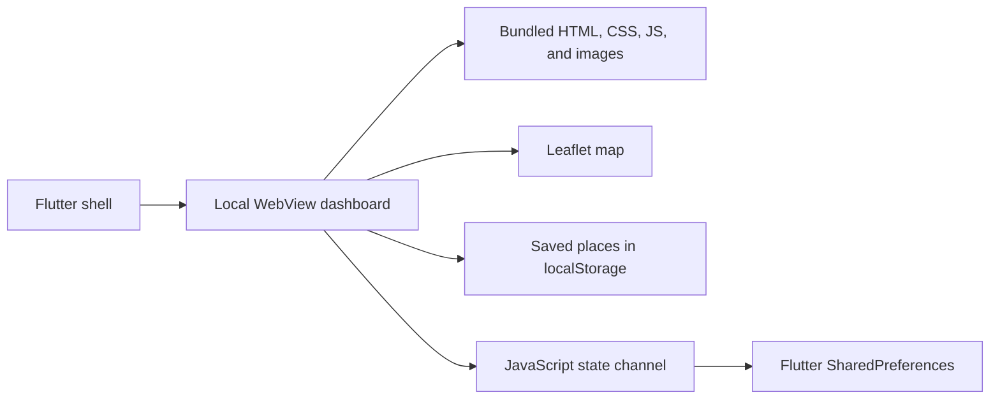

<div align="center">

  # InTravel

  **A local-first mobile guide for discovering and planning visits around Intramuros, Manila.**

  
  
  
</div>

## Overview

InTravel packages a responsive travel dashboard inside a Flutter application. Its destination directory, local photos, details, planning interface, saved places, and navigation state are bundled with the app, allowing the core guide to work without a remote application server.

The current experience focuses on historical and cultural destinations around Intramuros.

## Features

- Browse fortifications, landmarks, museums, churches, parks, and riverfront locations.
- Search and filter a curated Intramuros destination directory.
- Open detailed place pages with historical context, highlights, access notes, and related destinations.
- Explore an interactive Leaflet map with standard and satellite views.
- View a sample route and recenter the map around Intramuros.
- Filter itinerary suggestions and estimate a simple trip budget.
- Save and remove favorite places locally.
- Restore the current screen, detail page, and navigation history after restarting the app.
- Toggle dark mode and accessibility-focused interface options.
- Use Android's back action to navigate inside the embedded experience before exiting.
- Block arbitrary top-level webpages from replacing the trusted bundled dashboard.

## Local-first architecture



- `lib/main.dart` creates the Flutter shell and WebView.
- `assets/intravel/index.html` contains the dashboard interface and application logic.
- `assets/intravel/assets/` contains local icons and destination imagery.
- A JavaScript channel sends navigation state to Flutter.
- `shared_preferences` restores navigation across app restarts.

The bundled guide can load locally. Standard/satellite map tiles and any destination image referenced from an external URL still require network access.

## Getting started

### Requirements

- Flutter SDK compatible with Dart `^3.12.2`
- Android Studio or another configured Flutter development environment
- An Android emulator or physical device

```bash
git clone https://github.com/Mateeoow/intravel.git
cd intravel
flutter pub get
flutter run
```

You can also open the repository in Android Studio, wait for Flutter and Gradle synchronization, choose a device, and press **Run**.

## Quality checks

```bash
flutter analyze
flutter test
```

## Project structure

```text
assets/intravel/        Bundled travel dashboard
lib/main.dart           Flutter application and WebView bridge
test/                   Flutter tests
android/                Android platform project
ios/                    iOS platform project
web/                    Flutter web platform files
windows/ linux/ macos/  Desktop platform projects
```

## Current scope

- Authentication is represented in the interface but is not yet connected to an account backend.
- Saved places are local to the device/browser profile.
- Route lines and itinerary suggestions are curated examples rather than live turn-by-turn navigation.
- Visit hours, prices, and access conditions can change; users should confirm details with the destination or Intramuros Administration.

## Roadmap

- Connect live route guidance and device location
- Add editable multi-stop itineraries
- Cache map tiles where licensing and platform rules permit it
- Add cloud synchronization for signed-in travelers
- Expand beyond Intramuros to more Philippine heritage districts

## Author

Built by [Martin Gayem](https://github.com/Mateeoow) as a mobile UI, local-state, and tourism-information project.
